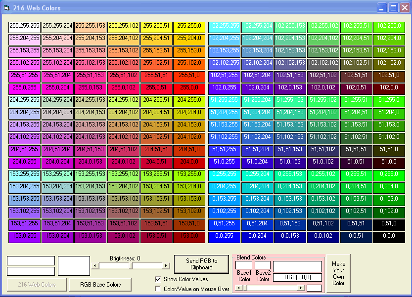



## Web Colors 216 Plus

### Description

Just playing around with colors and ways to manipulate them. Hopefully you will find something good here to use.
 
### More Info
 

             |
---                |---
**Submitted On**   |2008-11-22 11:59:12
**By**             |[Kenneth Foster](https://github.com/Planet-Source-Code/PSCIndex/blob/master/ByAuthor/kenneth-foster.md)
**Level**          |Intermediate
**User Rating**    |5.0 (10 globes from 2 users)
**Compatibility**  |VB 6\.0
**Category**       |[Graphics](https://github.com/Planet-Source-Code/PSCIndex/blob/master/ByCategory/graphics__1-46.md)
**World**          |[Visual Basic](https://github.com/Planet-Source-Code/PSCIndex/blob/master/ByWorld/visual-basic.md)
**Archive File**   |[Web\_Colors21351011222008\.zip](https://github.com/Planet-Source-Code/kenneth-foster-web-colors-216-plus__1-71434/archive/master.zip)

